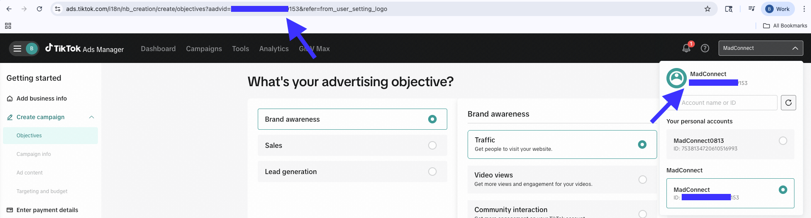

# Reddit API

.png>)

## Reddit Ads – Audiences Connector Overview

MadConnect integrates with the Reddit Ads API to enable advertisers to activate and manage first-party audiences for targeting and suppression. The Reddit Audiences connector supports creating new audiences and updating existing ones using approved, hashed identifiers, allowing advertisers to efficiently reach relevant Reddit users based on first-party data.

MadConnect manages normalization, hashing enforcement, schema validation, and API orchestration to ensure compliant and reliable audience delivery to Reddit.

***

### Connector Overview

| Field             | Description                                                        |
| ----------------- | ------------------------------------------------------------------ |
| Connector Type    | Destination                                                        |
| Data Type         | Audience Activation                                                |
| Primary Use Case  | First-party Audience Activation                                    |
| Description       | Create and manage Reddit custom audiences using hashed identifiers |
| Supported Actions | Create / Add / Remove                                              |

***

### Prerequisites

Before configuring the Reddit Audiences connector, ensure the following:

#### Reddit Account Requirements

1. An active Reddit Ads account
2. Permissions to manage Audiences within Reddit Ads Manager
3. Ability to authenticate via OAuth 2.0

#### MadConnect Requirements

1. An active MadConnect account
2. Audience data aligned to the MadConnect Standard Audience Schema

***

### Authentication Requirements

Reddit Audiences requires OAuth authentication.

#### OAuth Authentication (Required)

1. Navigate to **My Platforms** → **Reddit Ads – Audiences**
2. Click **Configure**
3. Select **Connect to Reddit Account**
4. Log in using your Reddit Ads credentials
5. Approve permissions to manage Reddit Segments
6. Upon success, the platform status will show **Configured** in **My Platforms**

OAuth tokens are securely stored via the platform.

<figure><figcaption></figcaption></figure>

***

### Connection Configuration (UI Fields)

Once the connector is configured, create a connection and provide the following when Reddit is selected as the destination.

#### Reddit Destination Fields

| Field         | Required | Description                  |
| ------------- | -------- | ---------------------------- |
| Advertiser ID | Yes      | Reddit ad account identifier |

This field determines which Reddit advertiser account the audience will be created or updated under.

***

### Audience Creation & Management Logic

Reddit audiences are managed using the following core fields.

#### Segment Fields

| Field         | Required     | Description                               |
| ------------- | ------------ | ----------------------------------------- |
| segment\_name | Yes (Create) | Name of the Reddit audience to be created |
| segment\_id   | Yes (Update) | Existing Reddit audience (segment) ID     |

#### Action Field

| Field  | Required | Description                                 |
| ------ | -------- | ------------------------------------------- |
| action | Yes      | Controls membership updates (add or remove) |

***

#### Creating a New Audience

1. Provide segment\_name
2. Omit segment\_id
3. Set action = add

MadConnect will:

1. Create a new Reddit audience
2. Upload hashed identifiers
3. Return the generated **segment\_id** in **Reports** → **info**

***

#### Updating an Existing Audience

1. Provide the existing **segment\_id**
2. Set **action** to **add** or **remove**
3. MadConnect will update membership for that audience

***

### Matching Keys (Reddit Audiences)

Reddit supports hashed identifiers only and allows multiple identifier types in a single request.

#### Supported Identifier Fields

| ID Type | Field Name    | Hashed | Notes                                |
| ------- | ------------- | ------ | ------------------------------------ |
| Email   | email\_sha256 | Yes    | SHA-256 hashed email                 |
| MAID    | maid\_sha256  | Yes    | SHA-256 hashed mobile advertising ID |

Important Reddit Behavior

1. Multiple identifier types (e.g., email + MAID) may be included in the same upload to improve match rates

***

### MadConnect Standard Audience Schema Example

Your source file or table should generally follow this structure to ensure seamless integration.

| Field Name    | Data Type | Required?                 | Description                                          |
| ------------- | --------- | ------------------------- | ---------------------------------------------------- |
| segment\_name | String    | Yes (Create)              | Name of the audience (e.g., Holiday Shoppers).       |
| segment\_id   | String    | Yes (Update)              | Reddit audience ID (required only when updating).    |
| action        | String    | Yes                       | Accepted values: add or remove.                      |
| email\_sha256 | String    | At least one supported ID | User’s email address, normalized and SHA-256 hashed. |

Notes

1. At least one supported identifier is required per row
2. email\_sha256 is shown as an example; maid\_sha256 may also be used
3. This schema is shared across all MadConnect audience connectors

***

### Hashing & Normalization Requirements

1. Algorithm: **SHA-256**
2. **Normalization (before hashing):**
   * Lowercase values
   * Remove whitespace
3. **Email-specific requirement (Reddit):**
   * Remove . and + symbols from the username portion of the email
   * Example: Example.Email+test@gmail.com → exampleemail@gmail.com
4. **MAID normalization:**
   * Lowercase
   * Remove whitespace

Incorrect normalization is the most common cause of low match rates.

***

### Important Notes & Limitations

1. Reddit may require a minimum audience size before an audience can be used for targeting
2. Match rates depend heavily on data quality and normalization accuracy
3. Newly created audiences may take time to become available in the UI
4. API errors often indicate normalization or hashing issues

***

### Resources

1. [Reddit Ads API – Audiences](https://ads-api.reddit.com/docs/v3/operations/Update%20Custom%20Audience%20Users)

