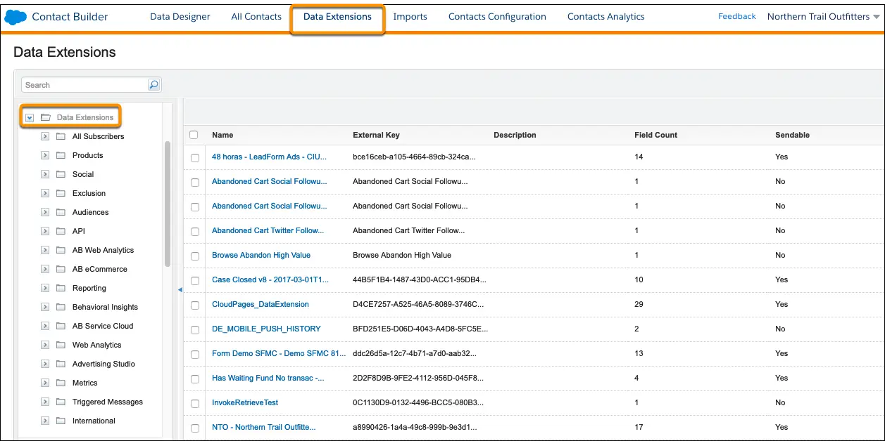

# SnapChat- Conversions API (New)

<div align="left"><figure><figcaption></figcaption></figure></div>

## **Snapchat Ads – Conversions API Connector Overview**

MadConnect enables seamless integration with Snapchat Ads, allowing advertisers to sync conversion event data from mobile apps or websites. This integration supports real-time tracking and precise optimization of campaigns based on custom or offline conversion events.

***

### **Connector Overview**

* **Source / Destination**: Destination
* **Data Type**: Conversions
* **Description**: Sync conversion data from your platform to Snapchat Ads, enabling optimization of your campaigns using web or app-based conversion events.
* **Supported Actions**: Add

***

### **Prerequisites**

To activate the connector, ensure the following:

1. **Active Snapchat Ads Account**
   * Ensure you have an active Snapchat Ads account with permissions to manage conversion events.
2. **OAuth Authentication**
   * Use OAuth to authenticate and grant permissions for managing conversion data through MadConnect.
3. **Conversion Schema Preparation**
   * Prepare your conversion data file according to Snapchat’s required schema (details provided below).

***

### **Configure Connector**

1. **Navigate to the My Platforms Section**
   * In the MadConnect UI, go to the **"My Platforms"** section.
2. **Add a New Platform**
   * Click on **"Add Platform."**
3. **Select Snapchat - Conversions**
   * Choose the **"Snapchat - Conversions"** tile and click on **"Configure."**
4. **Go to Configuration**
   * Navigate to the **"Configuration"** tab.
5. **Sign in with Snapchat**
   * Click the **"Sign in with Snapchat"** button to authenticate using OAuth.
6. **Authenticate with Snapchat**
   * You will be redirected to Snapchat’s login page. Sign in using your Snapchat account credentials.
7. **Authorize MadConnect**
   * Grant MadConnect permission to access and manage your Snapchat Ads account.
8. **Verify Configuration**
   * Ensure the connector status is marked as **"Configured"** under **My Platforms.**

***

### **Conversion Schema Requirements**

To send conversion data to Snapchat Ads, the following schema must be adhered to:

#### **Required Fields**

1. **Event Name**
   * **Field Name**: event\_name
   * **Data Type**: String
   * **Description**: Specifies the type of conversion event (e.g., purchase, sign-up, add-to-cart).
   * **Example**: purchase
2. **Timestamp**
   * **Field Name**: event\_time
   * **Data Type**: Integer (Unix Timestamp)
   * **Description**: The timestamp of the conversion event.
   * **Example**: 1705508777
3. **Action Source**
   * **Field Name**: action\_source
   * **Data Type**: String
   * **Description**: The origin of the conversion event (e.g., MOBILE\_APP, WEB).
   * **Example**: MOBILE\_APP
4. **User Data**
   * **Field Name**: user\_data
   * **Data Type**: Object
   * **Description**: Includes at least one identifier for matching:
     * em (hashed email)
     * ph (hashed phone number)
     * client\_ip\_address & client\_user\_agent (for web events)
     * madid (Mobile Advertising ID for app events)
   *   **Example**:

       ```
       json
       ```

       Copy code

       { "em": \["e3b0c44298fc1c149afbf4c8996fb92427ae41e4649b934ca495991b7852b855"], "ph": \["7b17fb0bd173f625b58636fb796407c22b3d16fc78302d79f0fd30c2fc2fc068"] }
5. **Conversion Value**
   * **Field Name**: conversion\_value
   * **Data Type**: Float
   * **Description**: The monetary value of the conversion event (e.g., purchase amount).
   * **Example**: 29.99
6. **Currency**
   * **Field Name**: currency
   * **Data Type**: String (ISO 4217 Format)
   * **Description**: The currency of the conversion value.
   * **Example**: USD

For details on parameters accepted by the Snapchat Ads Conversion API, please refer to [Snapchat’s documentation](https://developers.snap.com/api/marketing-api/Conversions-API/Parameters).

***

### **Important Notes**

1. **Data Privacy**
   * Ensure all user identifiers are hashed using SHA-256 before syncing to Snapchat Ads.
2. **Deduplication**
   * Include a unique event\_id for all events to prevent duplicate reporting across integrations (e.g., Pixel + API).
3. **Enhancing Matching**
   * For better matching accuracy, include additional recommended fields like sc\_click\_id or sc\_cookie1.

***

For further details, refer to the [Snapchat Ads Conversion API Documentation](https://developers.snap.com/api/marketing-api/Conversions-API/UsingTheAPI).
